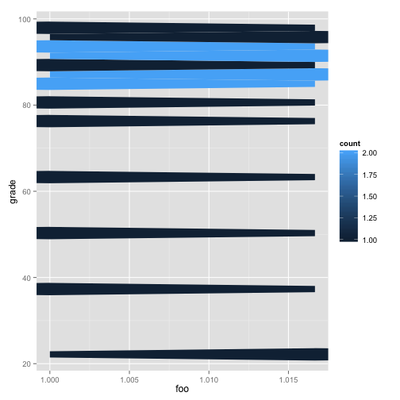

## Using ggplot


```r
library(ggplot2)
ggplot(diamonds, aes(carat, price)) + geom_hex()
```


Use `echo=FALSE` to hide the code block on your slide.

---

## Equations
The Arithmetic mean is equal to $\frac{1}{n} \sum_{i=i}^{n} x_{i}$, or the summation
of n numbers divided by n.

$$ H(X)=-\sum_{i}{P(x_i) log_b P(x_i)} $$

---

## Python!

Use fenced code blocks to render Python code with syntax highlighting.

```python
def hello():
  '''
  Such a boring function
  '''
  print 'hi!'
  
if __name__ == '__main__':
  hello()
```

--- .seque .dark

## Seque ##

---

## Getting Started with Slidify

You have to use Hadley's `devtools` package to download and install Slidify from Github.

```r
library(devtools)
install_github('slidify', 'ramnathv')
install_github('slidifyLibraries', 'ramnathv')
```

It is simple to create a new presentation.


```r
library(slidify)

# Create a new presentation called 'mydeck'
author("mydeck")
```


Slidify does much of the setup work for you (including creating the github repo). 
You just need to edit the `index.Rmd` file!

---

## Publishing your Presentation

When you are ready to share your handiwork.


```r
# Generate the Deck
slidify("index.Rmd")

# Publish it to github
publish(user = "rjwalls", repo = "SlidifyTest", host = "github")
```


Puts the presentation at <http://rjwalls.github.com/SlidifyTest>. Note that you need to setup your [Github SSH keys](https://help.github.com/articles/generating-ssh-keys).  

Can also use Rpubs or Dropbox.

---

## Slidify Philosophy

Separate the content writing from the its rendering.

---

## RMarkdown

You can use all of the features you love in Rmarkdown including:
 - bullets

As well as numbered lists:
 1. Thing 1
 2. Thing 2
 
*Italicized* and **bold** font. Or maybe not...


---

## IO2012

Animated lists:
> - Point 1
> - Point 2
> - Point 3

---

## Tables

Column 1  | Column 2
----------|---------
Foo       | Bar
Blah      | Blah
Bing      | Bang


--- #kittenwar

<iframe src = 'http://dillinger.io' height='600px'></iframe>

---


## Useful Links
 - [R Markdown Examples](https://gist.github.com/jeromyanglim/2716336)
 - [Slidify](http://slidify.org/)

---

## Adding existing R files


```r
knit("figure1.Rmd")
```

```
## 
## 
## processing file: figure1.Rmd output file: figure1.md
```

 


---


