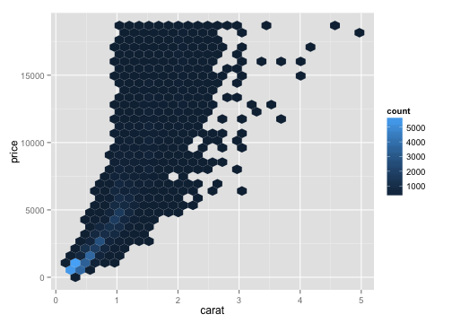

## Slidify

### An R package for Creating slides from R Markdown.


<div class='well'>
<p><b>Philosophy: </b> Separate the content writing from the its rendering.</p>
</div>

*** pnotes

Presenter notes go here. 


---

## Making Slides

Uses R Markdown.

Start a new slide with a blank line followed by three dashes (`---`).

```r
---

## Title

### Bigger text

Basic text:
 - Thing 1
 - Thing 2
```

---

## Title

### Big text

Basic text:
 1. Thing 1
 2. Thing 2

---

## R Markdown

### You can use all of the features you love in Rmarkdown including:
 - bullets
 - *Italicized* and **bold** font.

### As well as numbered lists:
 1. Thing 1
 2. Thing 2
 
### Animated lists:
> - This is probably specific to IO2012
> - Point 2

---

## Tables

Column 1  | Column 2
----------|---------
Foo       | Bar
Blah      | Blah
Bing      | Bang

```markdown
Column 1  | Column 2
----------|---------
Foo       | Bar
Blah      | Blah
Bing      | Bang
```

---

## Front Matter

Every deck starts with YAML to specify the basics.

```yaml
title       : Slidify 
subtitle    : Presentations from R Markdown
author      : Robert J. Walls
job         : University of Massachusetts
framework   : io2012        # {io2012, html5slides, shower, dzslides, ...}
highlighter : highlight.js  # {highlight.js, prettify, highlight}
hitheme     : tomorrow      # 
widgets     : [mathjax, bootstrap]     # {mathjax, quiz, bootstrap}
mode        : selfcontained # {standalone, draft}
biglogo     : robertsrobot.png
logo        : umass.png
```


---

## Tables from a Data.frame


```r
library(plyr)
library(ggplot2)

df <- diamonds[seq(1, 5), ]
df <- with(df, cbind(price, carat, cut, clarity))

# Make the header
header <- paste(colnames(df), collapse = " | ")
dashline <- paste(rep(c("---"), length(colnames(df))), collapse = " | ")

# Add the data
data <- aaply(df, 1, paste, collapse = " | ")
```


### It is actually running this code.

---

## Tables from a Data.frame


```r
cat(header, dashline, data, sep = "\n")
```

price | carat | cut | clarity
--- | --- | --- | ---
326 | 0.23 | 5 | 2
326 | 0.21 | 4 | 3
327 | 0.23 | 2 | 5
334 | 0.29 | 4 | 4
335 | 0.31 | 2 | 2


Make sure to set `results='asis'`.


---

## ggplot2


```r
library(ggplot2)
ggplot(diamonds, aes(carat, price)) + geom_hex()
```




Use `echo=FALSE` to hide the code block on your slide.

---

## Equations
### Write equations like you would in LaTeX.

Equations can be written inline, $\frac{1}{n} \sum_{i=i}^{n} x_{i}$, such as this. Or if you want to get fancy:

$$ H(X)=-\sum_{i}{P(x_i) log_b P(x_i)} $$

```
$\frac{1}{n} \sum_{i=i}^{n} x_{i}$
$$ H(X)=-\sum_{i}{P(x_i) log_b P(x_i)} $$
```
In the starting YAML, make sure to include 

```
widgets : [mathjax]
```

---

## Syntax Highlighting

Use fenced code blocks to render code with syntax highlighting.

>     ```python
>     ...CODE!
>     ```


```python
def hello():
  '''
  Such a boring function
  '''
  print 'hi!'
  
if __name__ == '__main__':
  hello()
```

---

## Getting Started

You have to use Hadley's `devtools` package to download and install Slidify from Github.

```r
library(devtools)
install_github('slidify', 'ramnathv')
install_github('slidifyLibraries', 'ramnathv')
```

It is simple to create a new presentation.

```r
library(slidify)

#Create a new presentation called 'mydeck'
author('mydeck')
```

Slidify does the setup work for you (including creating the github repo). 
You just need to edit the `index.Rmd` file!


---

## Publishing

Sharing your handiwork is easy.

```r
# Generate the Deck
slidify('index.Rmd')

# Publish it to github
publish(user='rjwalls', repo='SlidifyTest', host='github')
```

Puts the presentation at <http://rjwalls.github.com/SlidifyTest>. Note that you need to setup your [Github SSH keys](https://help.github.com/articles/generating-ssh-keys).  

Can also use Rpubs or Dropbox.

--- .segue .dark

## Where's the magic?

---

```yaml
title       : Slidify 
subtitle    : Presentations from R Markdown
author      : Robert J. Walls
job         : University of Massachusetts
framework   : io2012        # {io2012, html5slides, shower, dzslides, ...}
highlighter : highlight.js  # {highlight.js, prettify, highlight}
hitheme     : tomorrow      # 
widgets     : [mathjax, bootstrap]     # {mathjax, quiz, bootstrap}
mode        : selfcontained # {standalone, draft}
biglogo     : robertsrobot.png
logo        : umass.png
```

---

## IO2012 

The default slide framework is `io2012` from Google's 2012 I/O developer conference.

Adds some nice presenter features
 - Pressing 'p' toggles speaker notes (if they're on the current slide ((buggy)))
 - Pressing 'f' toggles fullscreen viewing
 - Pressing 'w' toggles widescreen
 - Pressing 'o' toggles overview mode
 - Pressing 'ESC' toggles off these goodies
 
Append [`?presentme=true`](http://rjwalls.github.io/SlidifyTest/) to the presentation url to get the presenter view. Use [`?presentme=false`](http://rjwalls.github.io/SlidifyTest/) to disable presenter mode.

---

## Slide Metadata

Slide level metadata are specified as key:value pairs. 
Commonly specified metadata like id, class and layout can also be identified by prefixing with punctuation marks #, . and & respectively. 

```
--- &vcenter
```

```
--- .segue .dark
```

```
--- .segue .quote .dark, bg:url(allyourbase.jpg)
```

--- &vcenter

```
--- &vcenter
```


Lime cat is important.

--- .segue .dark

```
--- .segue .dark
```

## Segue Slide

--- .segue .quote .dark, bg:url(allyourbase.jpg)

```
--- .segue .quote .dark, bg:url(allyourbase.jpg)
```

<q> All your base are belong to us. </q>

--- &twocol

## Two Column Layout   
### This slide *does not* have two columns, but it should.

*** =left
    
 - point 1
 - point 2
 - point 3

*** =right

 1. point 4
 2. point 5


--- .segue bg:url(successkid.jpg)

---

## Verdict

Quick and easy way to create presentations, *but* it's not quite ready to replace Keynote.

Lacking:
 - Animations
 - Presenter View
 - Spellcheck

### Useful Links
 - [R Markdown Examples](https://gist.github.com/jeromyanglim/2716336)
 - [Slidify Homepage](http://slidify.org/)
 - [I/O 2012 Template](https://code.google.com/p/io-2012-slides/)
 - [iquiz: A quiz widget for slidify](http://slidify.github.io/iquiz/)
 - [Ramnath Vaidyanathan's Github page](https://github.com/ramnathv/)
 
